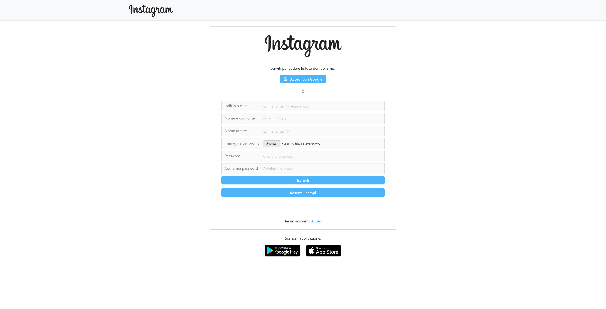

# Instagram - Node.js/Express

    
    

    
    

## Descrizione
Questo progetto rappresenta il back-end di una web-app che emula la celebre piattaforma Instagram.
É stato realizzato con l'intento di mettere in pratica e approfondire le tecnologie apprese di recente, e si interfaccia con un front-end per essere funzionale.

## Funzionalità
- **Autenticazione e autorizzazione**: Gestisce la registrazione, il login, e l'auth con Google OAuth 2.0, mantenendo le sessioni utente.

- **Gestione profilo utente**: Permette agli utenti di completare la registrazione con i dati mancanti (nel caso si siano autenticati tramite Google), aggiornare il profilo e cancellare l'account.

- **Gestione dei post**: Supporta la pubblicazione, la visualizzazione, e l'eliminazione dei post, inclusa la gestione di immagini.

- **Ricerca e visualizzazione**: Esegue la ricerca degli utenti e la visualizzazione dei loro profili e post.

- **Sicurezza dei dati**: Utilizza bcrypt per l'hashing e salting delle password e sessioni sicure per mantenere l'autenticazione.

- **Interfaccia API RESTful**: Facilita la comunicazione tra il front-end, che gestisce l'interfaccia utente, e il back-end, focalizzato sulle operazioni con il database postgreSQL, assicurando un'integrazione fluida.

## Tecnologie utilizzate
- **Node.js & Express**: Per la creazione del server e la gestione delle richieste API.
- **PostgreSQL**: Come sistema di gestione del database.

## Librerie utilizzate
- **Bcrypt**: Per l'hashing, il salting e la verifica delle password.
- **Passport**: Per l'implementazione dell'autenticazione, inclusa la strategia locale e Google OAuth 2.0.
- **Multer**: Per l'handling dell'upload dei file, gestisce i dati multipart/form-data necessari per la trasmissione attraverso form HTML.
- **Jimp**: Per la manipolazione delle immagini caricate.
- **Dotenv**: Per la configurazione privata delle variabili d'ambiente.
- **pg**: Per connettersi e interagire con il database PostgreSQL eseguendo query SQL.
- **express-session**: Per mantenere le sessioni utente attraverso richieste HTTP.
- **cors**: Per abilitare le richieste cross-origin dal front-end, autorizzandolo a comunicare con il back-end ospitato su un'origine differente.
- **express-validator**: Per validare e sanificare i dati in entrata.

## Installazione e avvio locale
1. Assicurati di avere Node.js e npm installati sul tuo sistema.
2. Clona il repository sul tuo computer locale.
3. Naviga nella directory del progetto.
4. Copia il file env.example e rinominalo in .env, personalizzandolo con i tuoi dati.
5. Installa le dipendenze con il comando `npm install`.
6. Avvia il server con il comando `node app.js`.

## Come utilizzare
Dopo aver avviato il server, il back-end sarà in ascolto sulla porta configurata (default: 3001). Il front-end, configurato per interagire con questo back-end, può ora effettuare richieste API per registrare utenti, autenticare, pubblicare post, ecc.

## Attenzione
Per una completa funzionalità di questa web-app, è necessario configurare il front-end. Assicurati di visitare e configurare l'altro progetto, disponibile qui: https://github.com/vito-pizzulli/react-instagram.

## Progetto didattico
Questa replica di Instagram è stata creata esclusivamente a scopo di apprendimento e sperimentazione tecnologica. Non è un prodotto commerciale, né intende violare i diritti di marchio di Instagram.